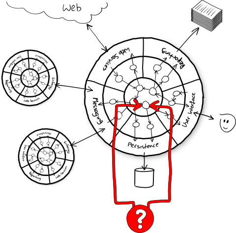
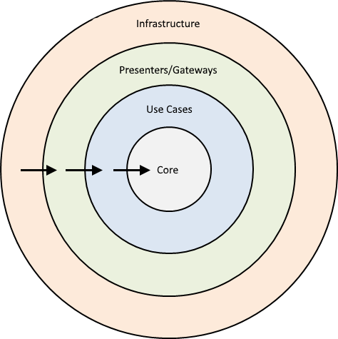
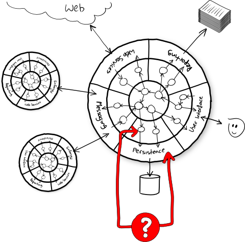
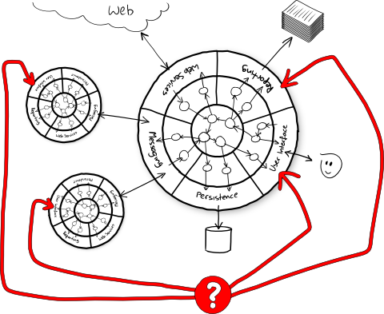

## Onion Architecture
with 
## Pure Functional Programming 
sauce

---
### Who am I?
- developer since 2001
- technical trainer/coach
- wannabe entrepreneur


+++
## Big thanks to


+++
## Big thanks to


---
## Talk target?
Combine the benefits of two good ideas:
- Pure functional programming
- Onion architecture

---
## The lab rat

The birthday greetings kata by Matteo Vaccari
http://matteo.vaccari.name/blog/archives/154

Code:
https://github.com/xpmatteo/birthday-greetings-kata

+++
## Scala edition

https://github.com/matteobaglini/birthday-greetings-kata-scala

+++
## Kata Purpose

To **learn** about the ~~hexagonal~~ onion architecture, which is a good way to **structure an application**, and how to shield your domain model from external apis and systems.

+++
## Problem (1/3)

Write a program that:
1. Loads a set of employee records from a flat file
2. Sends a greetings email to all employees whose birthday is today

+++
## Problem (2/3)

The flat file is a sequence of records, separated by newlines.
```
last_name, first_name, date_of_birth, email
Doe, John, 1982/10/08, john.doe@foobar.com
Ann, Mary, 1975/09/11, mary.ann@foobar.com
```

+++
## Problem (3/3)

The greetings email contains the following text.
```
Subject: Happy birthday!

Happy birthday, dear John!
```
with the first name of the employee substituted for `John`.

+++
## Ingredients

This kata can be done in two ways:
1. Hard way: **refactor the code** one tiny step at time until the code is *clean*. 
2. Simple way: implements the logic **from scratch**.

we pick the hard way, because refactoring is funny! :-)

+++
## let's add pure functional programming to the game!

+++
## Hard and FP way

**refactor the code** one tiny step at time until the code is *clean* and *pure*. 

+++
## Let's see the beast

+++?code=...&lang=Scala
TODO: punta alla classe birthdayservice e poi uno per uno zumma sui tre metodi 

+++
## At least, we have good news

+++
## There are the tests!


+++?code=...&lang=Scala
TODO: punta ad original AcceptanceTest, evidenzia che sono system test che necessitano dell'infrastruttura per testare il dominio

+++ 
## But they aren't unit


+++
## Our tests:
- touches the file system
- communicates across the network (SMTP)

---
## Pure Functional Programming

+++
what is?

+++
basic example

+++
benefits? build code that is easier to reason about, compose and test.

+++
really?

+++
TODO: show bad bad bad pure functional code, potresti anche prenderne uno a caso su internet?

+++
ok the problem is not pure functional programming.

+++
the problem is that we had follow only purity at the expense of all others good design practices.

+++
TODO: show tweet del tizio con il pappagallo sulla spalla

+++
> “Functional programming (pure or otherwise) is not the goal of software engineering. Rather, it’s a means to an end, like every other tool in the bag of a software engineer.” - John A De Goes 

+++
## What's the end?

As a developer, my job is to produce:

1. Code that works reliably.
2. Code that can be easily understood.
3. Code that minimize the cost of change.

+++
As a developer, my job is to produce **working, comprehensible, maintainable software**.

+++
Functional Programming can bring me a lot of benefits but isn't the whole game.

+++
How can I *properly* decompose a big system?

+++
*properly* means: in a modular and composable way.

---
## Onion Architecture

+++
it's an architectural stereotypes, a set of rules to assign responsibility at scale

+++


+++
## Benefits:
- domain's code speak loudly
- different domains stay strongly separated
- infrastructure's code is confined
- encapsulate different levels of abstraction
- centralize cross-cutting concerns
- easy testability

+++
## Onion rules
- The application is built around an independent core.
- Inner layers define interfaces. Outer layers implement interfaces
- Direction of coupling is toward the center
- All application core code can be compiled and run separate from infrastructure

+++
## Zoom in


+++
## Onion layers
vs
## Traditional layers

+++
## Traditional properties 
- it's a top-down architecture.
- each subsequent layer depends on the layers below it.
- each layer is coupled to the layers below it 

+++
## Traditional drawbacks
Thanks to transitive dependencies the UI and business logic are coupled to data access.

+++
## Onion as radar


+++
## Tests that do this are **integration/system tests**.



+++
Integration/System tests have their place, but:
- they are very slow.
- they are not so reliable.
- they hides the domain logic.

---
## Shut Up And Show Them The Code
+++
## Analyze the code from Onion and FP point of view

+++?code=...&lang=Scala
TODO: mix low and high level details, all dependencies points here, side-effects and mutable variable.

+++
## "shopping" list:
- split responsibilities in functions and modules
- remove mutable variable
- push the I/O ops at the boundary of the system
- handle side-effect (I/O) in a pure way
- handle failure/negative scenarious with effects
- express acceptance tests without infrastructure

--- 
## Split responsibilities

+++?code=...&lang=Scala
TODO: BS e` completamente stateless quindi marchiamolo come object, trasformiamolo in un modulo che contiene use cases

+++?code=...&lang=Scala
TODO: isolate load employees responsibility

+++?code=...&lang=Scala
TODO: extract load employees function

+++?code=...&lang=Scala
TODO: isolate filter birthdays

+++?code=...&lang=Scala
TODO: extract filter birthdays function

+++?code=...&lang=Scala
TODO: extract send messages function

--- 
## Remove mutable variable

+++?code=...&lang=Scala
TODO: punto di partenza

+++?code=...&lang=Scala
TODO: use io.Source

+++?code=...&lang=Scala
TODO: extract parseEmployee e withFile

+++?code=...&lang=Scala
TODO: mostrare sendMessages mixed resposibilities

+++?code=...&lang=Scala
TODO: inline 

+++?code=...&lang=Scala
TODO: all three extractions

--- 
## Push the I/O ops at the boundary of the system

+++?code=...&lang=Scala
TODO: Done!

---
## Handle side-effect (I/O) in a pure way

+++
```scala
  def loadEmployees(fileName: String): List[Employee]
  def whoHaveBirthday(loaded: List[Employee], today: XDate): List[Employee]
  def sendMessages(smtpHost: String, smtpPort: Int, employees: List[Employee]): Unit
```
TODO: le firme mentono, la prima e l'ultima effettuano I/O senza dirlo

+++
## IO Monad

- e' un astrazione per rendere IO puro
- per far si che le funzionino continuino a rispettare la RT

+++
## Enter Massi

e che me frega a me?

+++
## Referential Trasparency means easier refactoring

+++
## TODO: example con future, extract method, BOOM!

+++
## TODO: stesso example con IO, extract method, OK!

+++
## IO vs Programmers

IO monad e' un tema molto hot che genera molte discussioni e frizioni
E' una delle possibili strade
Non e' poi cosi' diverso dal programmare con i Future solo che e' piu' safe, quindi dove sta il problema?

+++
## Final Target
```scala
  def loadEmployees(fileName: String): IO[List[Employee]]

  def whoHaveBirthday(loaded: List[Employee], today: XDate): List[Employee]

  def sendMessages(smtpHost: String, smtpPort: Int, employees: List[Employee]): IO[Unit]
```

+++?code=...&lang=Scala
TODO: Use IO monad in loadLines [Matteo Baglini]

+++?code=...&lang=Scala
TODO: Use IO monad in loadEmployees [Matteo Baglini]

+++?code=...&lang=Scala
TODO: Use IO monad in sendMessage [Matteo Baglini]

+++?code=...&lang=Scala
TODO: Use IO monad in sendMessages [Matteo Baglini]

+++?code=...&lang=Scala
TODO: Use traverse to collect all side-effects into one [Matteo Baglini]

+++?code=...&lang=Scala
TODO: Discard list results [Matteo Baglini]

+++?code=...&lang=Scala
TODO: Use utility function to discard results [Matteo Baglini]

+++?code=...&lang=Scala
TODO: Move IO unsafeRunSync up to the main [Matteo Baglini]

+++?code=...&lang=Scala
TODO: Use for-comprehension

--- 
## Push the I/O ops at the boundary of the system (Take 2)
```scala
  def loadEmployees(fileName: String): IO[List[Employee]]

  def sendMessages(smtpHost: String, smtpPort: Int, employees: List[Employee]): IO[Unit]
```

---
## Split domain from infrastructure

+++
## Dependency Inversion Principle

the pillar of Onion Architecture

+++ 
## DIP 101

from
A -> B
to
A -> I <- B

+++
## DIP layers
Inner layers define interfaces. Outer layers implement interfaces

+++
## Infrastructure entry points
```scala
  def loadEmployees(fileName: String): IO[List[Employee]]

  def sendMessages(smtpHost: String, smtpPort: Int, employees: List[Employee]): IO[Unit]
```

+++?code=...&lang=Scala
TODO: Split domain params from infrstructure params [Matteo Baglini]

+++?code=...&lang=Scala
TODO: Define EmployeeRepository port [Matteo Baglini]

+++?code=...&lang=Scala
TODO: Define FlatFileEmployeeRepository adapter [Matteo Baglini]

+++?code=...&lang=Scala
TODO: Implement FlatFileEmployeeRepository adapter [Matteo Baglini]

+++?code=...&lang=Scala
TODO: Use EmployeeRepository and FlatFileEmployeeRepository [Matteo Baglini]

+++?code=...&lang=Scala
TODO: Define MessageGateway port [Matteo Baglini]

+++?code=...&lang=Scala
TODO: Define SmtpMessageGateway adapter [Matteo Baglini]

+++?code=...&lang=Scala
TODO: Implement SmtpMessageGateway adapter [Matteo Baglini]

+++?code=...&lang=Scala
TODO: Use MessageGateway and SmtpMessageGateway [Matteo Baglini]

+++?code=...&lang=Scala
TODO: Use implicit to pass infrastructure dependencies [Matteo Baglini]

---
## Acceptance tests w/out infrastructure

+++?code=...&lang=Scala
TODO: Rename acceptance to system test [Matteo Baglini]

+++?code=...&lang=Scala
TODO: Express acceptance tests without infrastructure [Matteo Baglini]

+++?code=...&lang=Scala
TODO: Abtract ports over effect type [Matteo Baglini]

+++?code=...&lang=Scala
TODO: Propagate effect abstraction to FlatFileEmployeeRepository [Matteo Baglini]

+++?code=...&lang=Scala
TODO: Propagate effect abstraction to SmtpMessageGateway [Matteo Baglini]

+++?code=...&lang=Scala
TODO: Use State monad as in memory store for acceptance tests [Matteo Baglini]

---
## New Requirement: beautiful report happy/error paths

IO already handle errors/exceptions but in a dynamic/implicit way.
Like in async computation copture exception on caller, propagate it until the end of the world.
For IO is usafeRunSync.

+++
## As is the error handling strategy is very easy

+++
## Let it crash!


+++
## Either effect
the static/explicit way is to use Either monad.

+++
## Prototype (1/N)
```scala
 def sendGreetings[F[_]](today: XDate)(
      implicit M: Monad[F],
      employeeRepository: EmployeeRepository[F],
      messageGateway: MessageGateway[F]): F[Unit]
```
stating point

+++
## Prototype (2/N)
```scala
 def sendGreetings[F[_]](today: XDate)(
      implicit M: Monad[F],
      employeeRepository: EmployeeRepository[F],
      messageGateway: MessageGateway[F],
      display: Display[F],
      ): F[Unit]
```
handler error internally and print with a new port
not a scalable solution, all use cases need it.

+++
## Prototype (3/N)
```scala
 def sendGreetings[F[_]](today: XDate)(
      implicit M: Monad[F],
      employeeRepository: EmployeeRepository[F],
      messageGateway: MessageGateway[F]
      ): F[Either[Throwable, Unit]]
```
instead of returns only the computed result (Unit)
ruturns alse the possible exception.

+++
## Prototype (4/N)
```scala
 def sendGreetings[F[_]](today: XDate)(
      implicit M: Monad[F],
      employeeRepository: EmployeeRepository[F],
      messageGateway: MessageGateway[F]
      ): F[Either[Throwable, Unit]]

 // ...in another module
 def display[F[_]](result: Either[Throwable, Unit])(
     implicit display: Display[F]
     ): F[Unit]
```
add a generic handling use case function.

+++
## Prototype (5/N)
```scala
 def sendGreetings[F[_]](today: XDate)(
      implicit M: Monad[F],
      employeeRepository: EmployeeRepository[F],
      messageGateway: MessageGateway[F]
      ): F[Either[Throwable, Unit]]

 // ...in another module
 def display[F[_], A](result: Either[Throwable, A])(
     implicit display: Display[F]
     ): F[A]
```
open return value with a type parameter.

+++
## Let develop display test first
