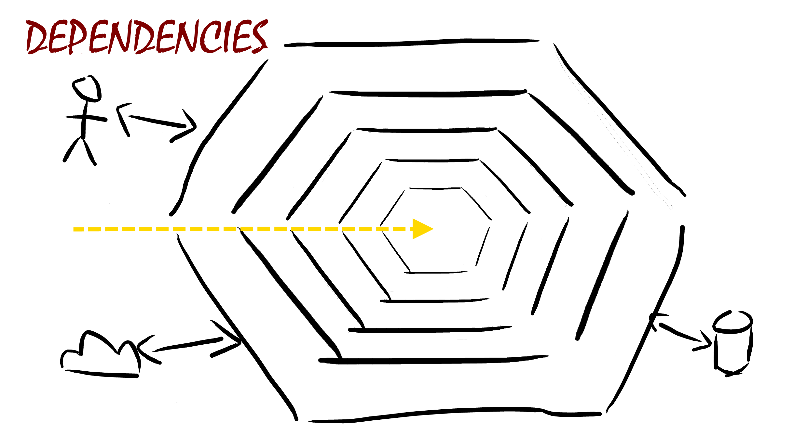

## @color[GoldenRod](Onion) Architecture
with
## @color[IndianRed](Pure) Functional Programming
sauce

---
# Who am I?


<br /><br />
- declared developer :-)
- enthusiastic technical trainer/coach
- wannabe entrepreneur

+++
# Big thanks to
<br /><br />


---
# The @color[GoldenRod](lab) rat

+++
## @color[GoldenRod](birthday greetings) kata
by Matteo Vaccari
<br /><br />
https://github.com/xpmatteo/birthday-greetings-kata
http://matteo.vaccari.name/blog/archives/154

+++
## @color[IndianRed](Scala) Porting
by Me :-)
<br /><br />
https://github.com/matteobaglini/birthday-greetings-kata-scala

+++
## @color[GoldenRod](Kata Purpose)
<br />
### To @color[IndianRed](learn) about
### the ~~hexagonal~~ onion architecture

+++
## Problem @size[0.2em](1/2)
@color[GoldenRod](write a program that)
1. Loads a set of employee records from a flat file
2. Sends a greetings email to all employees whose birthday is today

+++
## Problem @size[0.2em](2/2)
@color[GoldenRod](flat file format)
```javascript
last_name, first_name, date_of_birth, email
Doe, John, 1982/10/08, john.doe@foobar.com
Ann, Mary, 1975/09/11, mary.ann@foobar.com
```
@color[IndianRed](greetings email format)
```AsciiDoc
Subject: Happy birthday!
Happy birthday, dear {employee's first name}!
```

+++
## How to do it
1. @color[GoldenRod](Hard way): refactor the code one tiny step at time until the code is *clean*
2. @color[IndianRed](Simple way): implements the logic from scratch

+++
## we're going to pick the @color[IndianRed](hard way)
## because @color[GoldenRod](refactoring is fun!) :-)

+++
## where is
## @color[GoldenRod](pure functional programming)
## ?

+++
## Hard way 2.0
refactor the code one tiny step at time<br />
until the code is @color[GoldenRod](*clean*) and @color[IndianRed](*pure*)

+++
## Let's see the beast
```scala
def sendGreetings(fileName: String,
                  today: XDate,
                  smtpHost: String,
                  smtpPort: Int): Unit = {
  val in = new BufferedReader(new FileReader(fileName))
  var str = ""
  str = in.readLine // skip header
  while ({ str = in.readLine; str != null }) {
    val employeeData = str.split(", ")
    val employee = Employee(employeeData(1),
                            employeeData(0),
                            employeeData(2),
                            employeeData(3))

    if (employee.isBirthday(today)) {
      val recipient = employee.email
      val body = s"Happy Birthday, dear ${employee.firstName}!"
      val subject = "Happy Birthday!"

      sendMessage(smtpHost,
                  smtpPort,
                  "sender@here.com",
                  subject,
                  body,
                  recipient)
    }
  }
}
```
@[1-4](use case entry point)
@[5-8](read file content)
@[8-13](parse each line)
@[15](birthday check)
@[16-25](send message)

+++
## There are tests!


+++ 
## But they @color[GoldenRod](test only)
## at @color[IndianRed](system level)

+++
## System Tests
```scala
private val NONSTANDARD_PORT = 555

def setup(): SimpleSmtpServer = {
  SimpleSmtpServer.start(NONSTANDARD_PORT)
}

def tearDown(mailServer: SimpleSmtpServer): Unit = {
  mailServer.stop()
}

test("will send greetings when its somebody's birthday") {
  sendGreetings("employee_data.txt",
                XDate("2008/10/08"),
                "localhost",
                NONSTANDARD_PORT)

  assert(mailServer.getReceivedEmailSize == 1, "message not sent?")
  val message = mailServer.getReceivedEmail()
                    .next().asInstanceOf[SmtpMessage]
  assertEquals("Happy Birthday, dear John!", message.getBody)
  assertEquals("Happy Birthday!", message.getHeaderValue("Subject"))
```

@[1-9](setup the SMTP server)
@[12-15](interact with file system and network)
@[17-21](complex asserts)

---
# @color[GoldenRod](Pure)
# Functional
# @color[IndianRed](Programming)

+++
## Functional Programming
compose functions as a central<br />
building block to write software
<br /><br />
```scala
val f: A => B
```

+++
## Function examples
```scala
val toS : Int => String = 
  n => n.toString

val fromS : String => Int = 
  s => s.length
```
@[1-2](from Int to String)
@[4-5](from String to Int)

+++
## The pure version
in this context “function” refer to the mathematical one
- @color[GoldenRod](Totality): A function must yield a value for every possible input
- @color[GoldenRod](Determinism): A function must yield the same value for the same input
- @color[GoldenRod](Pure): A function’s only effect must be the computation of its return value

+++
## In few words
## Functions must be
## @color[GoldenRod](Referentially Trasparent)

+++
## This is not allowed
<br /><br />
```scala
val toS : Int => String = n => {
  appendAll("log.txt", "some content")
  n.toString
}
```
@[2](write to a file)

+++
## Nor even this
<br /><br />
```scala
val list = collection.mutable.ListBuffer[Int]()
val toS : Int => String = n => {
  list += n
  if (list.size < 42) n.toString
  else "Yo!"
}
```
@[1,3](mutate external state)
@[4-5](return value depends from external state)

+++
> “Object-oriented programming makes code understandable by @color[GoldenRod](encapsulating moving parts).<br />Functional programming makes code understandable by @color[IndianRed](minimizing moving parts).”<br />— Michael Feathers

+++
## it's a huge constraint
## @color[GoldenRod](why embrace it)?

+++
## Pure FP Benefits
give you an @color[IndianRed](extraordinary boost) in terms of:
- @color[GoldenRod](understandability)
- @color[GoldenRod](composability)
- @color[GoldenRod](testability)

+++
> “Functional programming (pure or otherwise) @color[GoldenRod](isn't the goal) of software engineering.<br/ ><br />Rather, @color[IndianRed](it’s a means to an end), like every other tool in the bag of a software engineer.” <br />- John A De Goes 

---
# @color[GoldenRod](Onion)
# @color[IndianRed](Architecture)

+++
## What is it?
<br />
### it's an @color[GoldenRod](architectural stereotypes)
### useful to decompose a system
### in a @color[IndianRed](modular and composable) way

+++
## Alias
<br />
### @color[IndianRed](hexagonal)
or
### @color[GoldenRod](port/adapter)

+++
## 10,000 Feet View


+++
## Onion rules
- The application is built around an independent domain
- Direction of coupling is toward the center
- Inner layers define interfaces. Outer layers implement interfaces
- Domain code can be compiled and run separate from infrastructure

+++
## Zoom in @size[0.2em](1/3)


+++
## Zoom in @size[0.2em](2/3)


+++
## Zoom in @size[0.2em](3/3)


+++
## Architecture Benefits
- domain's code speaks loudly
- infrastructure's code is contained
- encapsulate different levels of abstraction
- centralize cross-cutting concerns
- reduce the need of system tests

+++
## Onion as a radar


+++
## Radar benefits
give you a tool useful to avoid:
- mixing @color[GoldenRod](many responsibilities)
- mixing @color[GoldenRod](level of abstraction)
- mixing @color[GoldenRod](orthogonal concerns)
- mixing @color[GoldenRod](domain with infrastructure)

---
# Let the
# @color[IndianRed](marriage) begins

+++
## Remember?
```scala
def sendGreetings(fileName: String,
                  today: XDate,
                  smtpHost: String,
                  smtpPort: Int): Unit = {
  val in = new BufferedReader(new FileReader(fileName))
  var str = ""
  str = in.readLine // skip header
  while ({ str = in.readLine; str != null }) {
    val employeeData = str.split(", ")
    val employee = Employee(employeeData(1),
                            employeeData(0),
                            employeeData(2),
                            employeeData(3))

    if (employee.isBirthday(today)) {
      val recipient = employee.email
      val body = s"Happy Birthday, dear ${employee.firstName}!"
      val subject = "Happy Birthday!"

      sendMessage(smtpHost,
                  smtpPort,
                  "sender@here.com",
                  subject,
                  body,
                  recipient)
    }
  }
}
```

+++
## Now


+++
## Final Vision


+++
## Shopping list
- split responsibilities in functions
    - push I/O at the boundary of the system
- remove mutable variables
- handle side-effect (I/O)
- express acceptance tests without infrastructure

--- 
# Split @color[GoldenRod](responsibilities)

+++
## high level view
```scala
def sendGreetings(fileName: String,
                  today: XDate,
                  smtpHost: String,
                  smtpPort: Int): Unit = {
  // open file ...                      
  while ({ str = in.readLine; str != null }) {
    // ... build employee
    // ... birthday check
    // ... send message
  }
}
```
@[6-10](refactoring blind spot)

+++
## split loops
```scala
def sendGreetings(fileName: String // ...
  import collection.mutable.ListBuffer
  val employees = new ListBuffer[Employee]
  val in = new BufferedReader(new FileReader(fileName))
  var str = in.readLine // skip header
  while ({ str = in.readLine; str != null }) {
    val employeeData = str.split(", ")
    val employee = Employee(employeeData(1),
                            employeeData(0),
                            employeeData(2),
                            employeeData(3))
    employees += employee
  }
  val loaded = employees.toList

  for (employee <- loaded) {
    if (employee.isBirthday(today)) {
```
@[6-13](split load employees loop)
@[16-17](from othe logic)
@[2-3,6,12,14,16](use local buffer)

+++
## Extract loadEmployees
```scala
private def loadEmployees(fileName: String): List[Employee] = {
  import collection.mutable.ListBuffer
  val employees = new ListBuffer[Employee]
  val in = new BufferedReader(new FileReader(fileName))
  var str = in.readLine // skip header
  while ({ str = in.readLine; str != null }) {
    val employeeData = str.split(", ")
    val employee = Employee(employeeData(1),
                            employeeData(0),
                            employeeData(2),
                            employeeData(3))
    employees += employee
  }
  employees.toList
}
```

+++
## Extract loadEmployees
```scala
def sendGreetings(fileName: String // ...
  val loaded = loadEmployees(fileName)
  for (employee <- loaded) { 
  // ...
}
```
@[2]()

+++
## Split and extract haveBirthday
```scala
private def haveBirthday(loaded: List[Employee],
                         today: XDate): List[Employee] = {
  import collection.mutable.ListBuffer
  val employees = new ListBuffer[Employee]
  for (employee <- loaded) {
    if (employee.isBirthday(today)) {
      employees += employee
    }
  }
  employees.toList
}
```

+++
## Split and extract haveBirthday
```scala
def sendGreetings(fileName: String // ...
  val loaded = loadEmployees(fileName)
  val birthdays = haveBirthday(loaded, today)
  for (employee <- birthdays) { 
  // ...
}
```
@[3]()

+++
## Extract sendMessages
```scala
private def sendMessages(smtpHost: String,
                         smtpPort: Int,
                         employees: List[Employee]): Unit = {
  for (employee <- employees) {
    val recipient = employee.email
    val body = s"Happy Birthday, dear ${employee.firstName}!"
    val subject = "Happy Birthday!"

    sendMessage(smtpHost,
                smtpPort,
                "sender@here.com",
                subject,
                body,
                recipient)
  }
}
```

+++
## Extract sendMessages
```scala
def sendGreetings(fileName: String // ...
  val loaded = loadEmployees(fileName)
  val birthdays = haveBirthday(loaded, today)
  sendMessages(smtpHost, smtpPort, birthdays)
}
```
@[4](extract sendMessages)

+++
## Actual status


--- 
# Remove
# @color[IndianRed](mutable)
# state

+++
## Extract parseEmployee
```scala
private def loadEmployees(fileName: String): List[Employee] = {
  import collection.mutable.ListBuffer
  val employees = new ListBuffer[Employee]
  val in = new BufferedReader(new FileReader(fileName))
  var str = in.readLine // skip header
  while ({ str = in.readLine; str != null }) {
    val employeeData = str.split(", ")
    val employee = Employee(employeeData(1),
                            employeeData(0),
                            employeeData(2),
                            employeeData(3))
    employees += employee
  }
  employees.toList
}
```
@[7-11]()

+++
## From imperative style
```scala
private def loadEmployees(fileName: String): List[Employee] = {
  import collection.mutable.ListBuffer
  val employees = new ListBuffer[Employee]
  val in = new BufferedReader(new FileReader(fileName))
  var str = in.readLine // skip header
  while ({ str = in.readLine; str != null }) {
    employees += parseEmployee(str) 
  }
  employees.toList
}
```
@[5](mutable var for each line)
@[3,7](mutable collection as accumulator)

+++
## To declarative style
```scala
private def loadEmployees(fileName: String): List[Employee] = {
  val source = io.Source.fromFile(fileName)
  val lines = source.getLines.toList
  lines
    .drop(1) // skip header
    .map(parseEmployee(_))
}
```
@[2-3](load)
@[4-6](after load)

+++
## Extract loadLines
```scala
private def loadLines(fileName: String): List[String] = {
  val source = io.Source.fromFile(fileName)
  try source.getLines.toList
  finally source.close
}
```
@[3-4](release resource)

+++
## Same level of abstraction
```scala
private def loadEmployees(fileName: String): List[Employee] = {
  loadLines(fileName)
    .drop(1) // skip header
    .map(parseEmployee(_))
}
```
@[2](base problem solution)
@[3](derive next solution)
@[4](derive next solution)

+++
## Abstraction escalation
```scala
private def loadLines(fileName: String)
                    : List[String]

private def loadEmployees(fileName: String)
                    : List[Employee]
```
@[2](from List[String])
@[5](to List[Employee])

+++
## Imperative haveBirthday
```scala
private def haveBirthday(loaded: List[Employee],
                         today: XDate): List[Employee] = {
  import collection.mutable.ListBuffer
  val employees = new ListBuffer[Employee]
  for (employee <- loaded) {
    if (employee.isBirthday(today)) {
      employees += employee
    }
  }
  employees.toList
}
```
@[5-6](filter logic)

+++
## Declarative haveBirthday
```scala
private def haveBirthday(loaded: List[Employee],
                         today: XDate): List[Employee] =
  loaded.filter(_.isBirthday(today))
```

+++
## No mutable state but...
```scala
private def sendMessages(smtpHost: String,
                         smtpPort: Int,
                         employees: List[Employee]): Unit = {
  for (employee <- employees) {
    val recipient = employee.email
    val body = s"Happy Birthday, dear ${employee.firstName}!"
    val subject = "Happy Birthday!"

    sendMessage(smtpHost,
                smtpPort,
                "sender@here.com",
                subject,
                body,
                recipient)
  }
}
```
@[5-7](build message text)
@[9-14](send message)

+++
## Inline sendMessage
```scala
private def sendMessages(smtpHost: String,
                         smtpPort: Int,
                         employees: List[Employee]): Unit = {
  for (employee <- employees) {
    val recipient = employee.email
    val sender = "sender@here.com"
    val body = s"Happy Birthday, dear ${employee.firstName}!"
    val subject = "Happy Birthday!"

    val props = new Properties
    props.put("mail.smtp.host", smtpHost)
    props.put("mail.smtp.port", "" + smtpPort)
    val session = Session.getInstance(props, null)

    val msg = new MimeMessage(session)
    msg.setFrom(new InternetAddress(sender))
    msg.setRecipient(Message.RecipientType.TO, 
                     new InternetAddress(recipient))
    msg.setSubject(subject)
    msg.setText(body);

    Transport.send(msg)
  }
}
```
@[10-13](smtp connection)
@[5-8,15-20](compose message)
@[22](final send)

+++
## Extract buildSession
```scala
private def sendMessages(smtpHost: String,
                         smtpPort: Int,
                         employees: List[Employee]): Unit = {
  for (employee <- employees) {
    val session = buildSession(smtpHost, smtpPort)

    val recipient = employee.email
    val sender = "sender@here.com"
    val body = s"Happy Birthday, dear ${employee.firstName}!"
    val subject = "Happy Birthday!"

    val msg = new MimeMessage(session)
    msg.setFrom(new InternetAddress(sender))
    msg.setRecipient(Message.RecipientType.TO, new InternetAddress(recipient))
    msg.setSubject(subject)
    msg.setText(body);

    Transport.send(msg)
  }
}
```
@[5]()

+++
## Extract buildMessage
```scala
private def sendMessages(smtpHost: String,
                         smtpPort: Int,
                         employees: List[Employee]): Unit = {
  for (employee <- employees) {
    val session = buildSession(smtpHost, smtpPort)
    val msg = buildMessage(session, employee)
    Transport.send(msg)
  }
}
```
@[6]()

+++
## Extract sendMessage
```scala
private def sendMessages(smtpHost: String,
                         smtpPort: Int,
                         employees: List[Employee]): Unit = {
  for (employee <- employees)
    sendMessage(smtpHost, smtpPort, employee)
}
```
@[5]()

---
# Handle @color[IndianRed](side-effects)

+++
## Which one have side-effects?
```scala
def loadEmployees(/*...*/): List[Employee]

def haveBirthday(/*...*/): List[Employee]

def sendMessages(/*...*/): Unit
```
@[1](yes)
@[3](no)
@[5](yes)

+++
## How to handle I/O in pure fp?

+++
## IO Monad
it's a technique that enables to @color[GoldenRod](capture the intent)<br />
of I/O operations when they are invoked<br />
and @color[IndianRed](delays their execution) until explicitly requested.

+++ 
## Embedded DSL
- @color[GoldenRod](Language): a data structure that lazy capute I/O operations
- @color[IndianRed](Interpreter): an *engine* that walk the tree and execute I/O operations

+++
## Again, which one have side-effects?
```scala
def loadEmployees(/*...*/): IO[List[Employee]]

def haveBirthday(/*...*/): List[Employee]

def sendMessages(/*...*/): IO[Unit]
```

+++
## Benefits
@color[IndianRed](evidence code) that interact<br />
with the outside world and even more important<br />
@color[GoldenRod](preserves referential transparency)

+++
## @color[GoldenRod](Referential Trasparency)
## means
## @color[IndianRed](easier refactoring)

+++
## First example
## @color[IndianRed](NO)
## REFERENTIAL TRASPARENCY

+++
## Ask two numbers - @color[IndianRed](Future)
```scala
def askInt(): Future[Int] = 
  Future(println("Please, give me a number:"))
    .flatMap( _ => Future(io.StdIn.readLine().toInt))

def askTwoInt(): Future[(Int, Int)] =
  for {
    x <- askInt()
    y <- askInt()
  } yield (x , y)

def program(): Future[Unit] =
  askTwoInt()
    .flatMap(pair => Future(println(s"Result: ${pair}")))
```
@[1-3](ask a number)
@[5-9](execute askInt twice)
@[11-13](execute the program)

+++
## Output - @color[IndianRed](Future)


+++
## Refactored - @color[IndianRed](Future)
```scala
def askInt(): Future[Int] = 
  Future(println("Please, give me a number:"))
    .flatMap( _ => Future(io.StdIn.readLine().toInt))

def askTwoInt(): Future[(Int, Int)] = {
  val sameAsk = askInt()
  for {
    x <- sameAsk
    y <- sameAsk
  } yield (x , y)
}

def program(): Future[Unit] =
  askTwoInt()
    .flatMap(pair => Future(println(s"Result: ${pair}")))
```
@[5-11](extract local)

+++
## Refactored Output :-( - @color[IndianRed](Future)


+++
## Second example
## @color[GoldenRod](YES)
## REFERENTIAL TRASPARENCY

+++
## Ask two numbers - @color[GoldenRod](IO)
```scala
def askInt(): IO[Int] = 
  IO(println("Please, give me a number:"))
    .flatMap( _ => IO(io.StdIn.readLine().toInt))

def askTwoInt(): IO[(Int, Int)] =
  for {
    x <- askInt()
    y <- askInt()
  } yield (x , y)

def program(): IO[Unit] =
  askTwoInt()
    .flatMap(pair => IO(println(s"Result: ${pair}")))
```
@[1-3](ask a number)
@[5-9](execute askInt twice)
@[11-13](execute the program)

+++
## Output - @color[GoldenRod](IO)


+++
## Refactored - @color[GoldenRod](IO)
```scala
def askInt(): IO[Int] = 
  IO(println("Please, give me a number:"))
    .flatMap( _ => IO(io.StdIn.readLine().toInt))

def askTwoInt(): IO[(Int, Int)] = {
  val sameAsk = askInt()
  for {
    x <- sameAsk
    y <- sameAsk
  } yield (x , y)
}

def program(): IO[Unit] =
  askTwoInt()
    .flatMap(pair => IO(println(s"Result: ${pair}")))
```
@[5-11](extract local)

+++
## Refactored Output :-) - @color[GoldenRod](IO)


+++
## IO Monad war
this solution solves only the @color[GoldenRod](symptom)<br />
but not the @color[IndianRed](disease) as I/O is impure by nature

+++
## So why not use it?
working with IO Monad is @color[IndianRed](very similar) to<br />
working with Future @color[GoldenRod](plus)<br /> 
you get Referential Trasparency<br />

+++
## IO Monad in Scala


+++
## Let's start from input operation
```scala
private def loadLines(fileName: String): List[String] = {
  val source = io.Source.fromFile(fileName)
  try source.getLines.toList
  finally source.close
}
```
+++
## Done!
```scala
private def loadLines(fileName: String): IO[List[String]] = IO {
  val source = io.Source.fromFile(fileName)
  try source.getLines.toList
  finally source.close
}
```
@[1](see the IO wrapper?)

+++
## Safe resource acquisition/release
```scala
private def loadLines(fileName: String): IO[List[String]] =
  IO(io.Source.fromFile(fileName)).bracket { source =>
    IO(source.getLines.toList)
  } { source =>
    IO(source.close)
  }
```
@[2](bracket function)

+++
## Compose with upper layer
```scala
private def loadEmployees(fileName: String): IO[List[Employee]] = {
  loadLines(fileName).map { lines =>
    lines
      .drop(1) // skip header
      .map(parseEmployee(_))
  }
}
```
@[3-5](unchanged parsing logic)
@[2, 6](wrap in a map)
@[1](propagate IO)

+++
## Continue with output operation
```scala
private def sendMessage(smtpHost: String,
                        smtpPort: Int,
                        employee: Employee): IO[Unit] = IO {
  val session = buildSession(smtpHost, smtpPort)
  val msg = buildMessage(session, employee)
  Transport.send(msg)
}
```
@[3](see the IO wrapper?)

+++
## From execution of many I/O
```scala
private def sendMessages(smtpHost: String,
                         smtpPort: Int,
                         employees: List[Employee]): Unit = {
  for (employee <- employees)
    sendMessage(smtpHost, smtpPort, employee)
}
```

+++
## To construction of many IO
```scala
private def sendMessages(smtpHost: String,
                         smtpPort: Int,
                         employees: List[Employee]): List[IO[Unit]] = {
  employees.map { employee =>
    sendMessage(smtpHost, smtpPort, employee)
  }
}
```
@[4](from Employee to IO[Unit])
@[3](List[IO[Unit]] it's not what we want)

+++
## Traverse power!
```scala
private def sendMessages(smtpHost: String,
                         smtpPort: Int,
                         employees: List[Employee]): IO[List[Unit]] = {
  employees.traverse { employee =>
    sendMessage(smtpHost, smtpPort, employee)
  }
}
```
@[4](traversal over a structure with an effect)
@[3](better but List of Unit is like Unit)

+++
## Map vs Traverse
- @color[GoldenRod](map): produces a @color[GoldenRod](List[IO[A]])
- @color[IndianRed](traverse): produces a @color[IndianRed](IO[List[A]])

+++
## Discard results
```scala
private def sendMessages(smtpHost: String,
                         smtpPort: Int,
                         employees: List[Employee]): IO[Unit] = {
  employees.traverse { employee =>
    sendMessage(smtpHost, smtpPort, employee)
  }
  .map { _ => () }
}
```
@[7](discard results)
@[3](perfect type)

+++
## Discard results (compact)
```scala
private def sendMessages(smtpHost: String,
                         smtpPort: Int,
                         employees: List[Employee]): IO[Unit] = {
  employees.traverse_ { employee =>
    sendMessage(smtpHost, smtpPort, employee)
  }
}
```
@[4](discard results)

+++
## Execute I/O (temporarily)
```scala
def sendGreetings(fileName: String,
                  today: XDate,
                  smtpHost: String,
                  smtpPort: Int): Unit = {
  val loaded = loadEmployees(fileName)
    .unsafeRunSync()
  val birthdays = haveBirthday(loaded, today)
  sendMessages(smtpHost, smtpPort, birthdays)
    .unsafeRunSync()
}
```
@[6,9](must be removed)

+++
## Push up I/O execution
```scala
def sendGreetings(fileName: String,
                  today: XDate,
                  smtpHost: String,
                  smtpPort: Int): IO[Unit] = {
  loadEmployees(fileName)
    .map(loaded => haveBirthday(loaded, today))
    .flatMap(birthdays => sendMessages(smtpHost, smtpPort, birthdays))
}
```
@[4](add IO wrapper)
@[5]("register" a loadEmployees operations)
@[6](then change the content with map)
@[7](then replace the content with flatMap)

+++
## Hide composition operators
```scala
def sendGreetings(fileName: String,
                  today: XDate,
                  smtpHost: String,
                  smtpPort: Int): IO[Unit] = {
  for {
    loaded <- loadEmployees(fileName)
    birthdays = haveBirthday(loaded, today)
    _ <- sendMessages(smtpHost, smtpPort, birthdays)
  } yield ()
}
```
@[5-9](use for-comprehension)

+++
## The original Main
```scala
def main(args: Array[String]): Unit = {
  sendGreetings("employee_data.txt", XDate(), "localhost", 25)
}
```

+++
## The IO Monad Main
```scala
def main(args: Array[String]): Unit = {
  sendGreetings("employee_data.txt", XDate(), "localhost", 25)
    .unsafeRunSync()
}
```
@[3](add IO execution at "the end of the world")

---
# Split @color[GoldenRod](domain)
# From @color[IndianRed](infrastructure)

+++
## Now


+++
## Final Vision


+++
## The Onion architecture pillar
<br />
### @color[GoldenRod](Dependency Inversion Principle)

+++
## Dependency Inversion Principle
- @color[GoldenRod](High-level modules) should not depend on low-level modules. Both should depend on abstractions.
- @color[IndianRed](Abstractions) should not depend on details. Details should depend on abstractions.

+++
## DIP into Onion
- Inner layers define interfaces (@color[GoldenRod](Ports))
- Outer layers implement interfaces (@color[IndianRed](Adapters))

+++
## Infrastructure entry points
```scala
  def loadEmployees(fileName: String): IO[List[Employee]]

  def sendMessages(smtpHost: String, 
                   smtpPort: Int, 
                   employees: List[Employee]): IO[Unit]

  def sendGreetings(fileName: String,
                    today: XDate, 
                    smtpHost: String, 
                    smtpPort: Int): IO[Unit]
```

+++
## Split domain and infrastructure params
```scala
def loadEmployees()
                 (fileName: String): IO[List[Employee]]

def sendMessages(employees: List[Employee])
                (smtpHost: String, 
                 smtpPort: Int): IO[Unit]                       

def sendGreetings(today: XDate)
                 (fileName: String, 
                  smtpHost: String, 
                  smtpPort: Int): IO[Unit]
```
@[1,4,8](domain)
@[2,5-6,9-11](infrastructure)

+++
## Define the first Port
```scala
trait EmployeeRepository {
  def loadEmployees(): IO[List[Employee]]
}
```

+++
## Implement the first Adapter
```scala
object FlatFileEmployeeRepository {

  def fromFile(fileName: String): EmployeeRepository = 
    new EmployeeRepository {

    def loadEmployees(): IO[List[Employee]] = {
      loadLines().map { lines =>
        lines
          .drop(1) // skip header
          .map(parseEmployee(_))
      }
    }

    // ... loadLines and parseEmployee ...
  }
}
```
@[1](the adapter module specify the tecnology)
@[3-4](the real adapter is provided as anonymous class)
@[6-12](do the file related stuff)

+++
## Request the Port
```scala
def sendGreetings(today: XDate)
                 (employeeRepository: EmployeeRepository, 
                  smtpHost: String, 
                  smtpPort: Int): IO[Unit]
```
@[2](no more file parameter)

+++
## Provide the Adapter
```scala
def main(args: Array[String]): Unit = {
  val employeeRepository = 
        FlatFileEmployeeRepository.fromFile("employee_data.txt")

  sendGreetings(XDate())
    (employeeRepository, "localhost", 25)
    .unsafeRunSync()
}
```
@[2-3](build the concrete adapter)
@[6](inject into sendGreetings)

+++
## Define the second Port
```scala
trait MessageGateway {
  def sendMessages(employees: List[Employee]): IO[Unit]
}
```

+++
## Define the second Port
```scala
trait MessageGateway {

  def sendMessages(employees: List[Employee]): IO[Unit] =
    employees.traverse_(sendMessage(_))

  def sendMessage(employee: Employee): IO[Unit]
}
```
@[3-4](thanks to traverse we can put the implementation here)
@[6](and open sendMessage)

+++
## Implement the second Adapter
```scala
object SmtpMessageGateway {

  def fromEndpoint(smtpHost: String, smtpPort: Int): MessageGateway =
    new MessageGateway {

      def sendMessage(employee: Employee): IO[Unit] = IO {
        val session = buildSession()
        val msg = buildMessage(session, employee)
        Transport.send(msg)
      }

      // ...buildSession and buildMessage
    }
}
```
@[1](the adapter module specify the tecnology)
@[3-4](the real adapter is provided as anonymous class)
@[6-12](do the smtp related stuff)

+++
## Again, request the Port
```scala
def sendGreetings(today: XDate)
                 (employeeRepository: EmployeeRepository,
                  messageGateway: MessageGateway): IO[Unit]
```
@[3](no more smtp parameters)

+++
## Again, provide the Adapter
```scala
def main(args: Array[String]): Unit = {
  val employeeRepository = 
        FlatFileEmployeeRepository.fromFile("employee_data.txt")
  val messageGateway = 
        SmtpMessageGateway.fromEndpoint("localhost", 25)

  sendGreetings(XDate())
    (employeeRepository, messageGateway)
    .unsafeRunSync()
}
```
@[4-5](build the concrete adapter)
@[8](inject into sendGreetings)

+++
## Scala implicit to the rescue
```scala
def sendGreetings(today: XDate)
                 (implicit employeeRepository: EmployeeRepository, 
                           messageGateway: MessageGateway): IO[Unit]
```
@[2-3](mark the parameters as implicit)

+++
## Scala implicit to the rescue
```scala
def main(args: Array[String]): Unit = {
  implicit val employeeRepository = 
        FlatFileEmployeeRepository.fromFile("employee_data.txt")
  implicit val messageGateway = 
        SmtpMessageGateway.fromEndpoint("localhost", 25)

  sendGreetings(XDate())
    .unsafeRunSync()
}
```
@[2-5](mark provided values as implicit)
@[7](remove explicit injection)

+++
## Final implementation
```scala
def sendGreetings(today: XDate)
                 (implicit employeeRepository: EmployeeRepository, 
                           messageGateway: MessageGateway): IO[Unit] =
  for {
    loaded <- employeeRepository.loadEmployees(fileName)
    birthdays = haveBirthday(loaded, today)
    _ <- messageGateway.sendMessages(smtpHost, smtpPort, birthdays)
  } yield ()
```

+++
## Final implementation


---
# @color[GoldenRod](Acceptance tests) w/out @color[IndianRed](infrastructure)

+++
## Starting point
```scala
def setup(): SimpleSmtpServer = {
  SimpleSmtpServer.start(NONSTANDARD_PORT)
}

def tearDown(mailServer: SimpleSmtpServer): Unit = {
  mailServer.stop()
}

test("will send greetings when its somebody's birthday") {
  implicit val employeeRepository =
    FlatFileEmployeeRepository.fromFile("employee_data.txt")
  implicit val messageGateway =
    SmtpMessageGateway.fromEndpoint("localhost", NONSTANDARD_PORT)

  sendGreetings(XDate("2008/10/08"))
    .unsafeRunSync()

  assert(mailServer.getReceivedEmailSize == 1, "message not sent?")
  val message = mailServer.getReceivedEmail()
                    .next().asInstanceOf[SmtpMessage]
  assertEquals("Happy Birthday, dear John!", message.getBody)
  assertEquals("Happy Birthday!", message.getHeaderValue("Subject"))
  val recipients = message.getHeaderValues("To")
  assertEquals(1, recipients.length)
  assertEquals("john.doe@foobar.com", recipients(0).toString)
}
```
@[1-9](setup server smtp)
@[10-13](setup infrastrucural adapters)
@[18-25](complex asserts)

+++
## In memory acceptance tests
```scala
 test("will send greetings when its somebody's birthday") {
   val john = Employee("John", "Doe", 
                       "1982/10/08", "john.doe@foobar.com")
   val mary = Employee("Mary", "Ann", 
                       "1975/03/11", "mary.ann@foobar.com")
   implicit val fakeEmployeeRepository = 
                    new FakeEmployeeRepository(List(john, mary))
   implicit val fakeMessageGateway =        
                    new FakeMessageGateway()

   sendGreetings(XDate("2008/10/08"))
     .unsafeRunSync()

   assert(fakeMessageGateway.receivers.size == 1)
   assert(fakeMessageGateway.receivers.contains(john))
 }
```
@[2-7](setup fake repository)
@[8-9](setup fake gateway)
@[12-13](execute usecase)
@[14-15](simple asserts)

+++
## Test doubles implementation
```scala
class FakeEmployeeRepository(employees: List[Employee]) 
    extends EmployeeRepository {

  def loadEmployees(): IO[List[Employee]] = IO {
    employees
  }
}

class FakeMessageGateway 
    extends MessageGateway {

  val receivers = new collection.mutable.ListBuffer[Employee]

  def sendMessage(e: Employee): IO[Unit] = IO {
    receivers += e
  }
}
```
@[1-7](fake repository)
@[9-17](fake gateway)

---
# Closing notes

+++
## Next steps
- abstract over effect type
- make invalid state unrepresentable
- remove mutable state from acceptance tests
- use streaming I/O (from IO[List[A]] to Stream[IO, A])

+++
## Play with requirements
- handle error and print graceful messages
- remove dependency from configuration parameters
- different content for male/female (Mr/Ms)
- different infrastructure employee (SMTP + SMS) 

+++
## Conclusion

- Onion rules plus radar technique to @color[GoldenRod](distribute and encapsulate responsibilities)
- Functional Programming technique to @color[IndianRed](compose behaviours and layers)

+++
# @color[GoldenRod](Thanks)