## @color[GoldenRod](Onion) Architecture
with
## @color[IndianRed](Pure) Functional Programming
sauce

---
# Who am I?


<br /><br />
- declared @color[GoldenRod](developer) ;-)
- enthusiastic technical @color[GoldenRod](trainer/coach)
- wannabe @color[GoldenRod](entrepreneur)

---
# The @color[GoldenRod](lab) rat

+++
## @color[GoldenRod](birthday greetings) kata
by Matteo Vaccari
<br /><br />
https://github.com/xpmatteo/birthday-greetings-kata
<br/>
http://matteo.vaccari.name/blog/archives/154

+++
## @color[GoldenRod](Kata Purpose)
<br />
### To @color[IndianRed](learn) about
### the ~~hexagonal~~ onion architecture

+++
## @color[IndianRed](Scala) Porting
by Me :-)
<br /><br />
https://github.com/matteobaglini/birthday-greetings-kata-scala

+++
## Problem
@color[GoldenRod](write a program that)
1. Loads a set of employee records from a flat file
```javascript
last_name, first_name, date_of_birth, email
Doe, John, 1982/10/08, john.doe@foobar.com
Ann, Mary, 1975/09/11, mary.ann@foobar.com
```
2. Sends a greetings email to all employees whose birthday is today
```AsciiDoc
Subject: Happy birthday!
Happy birthday, dear {employee's first name}!
```

+++
## How to do it
1. @color[GoldenRod](Hard way): refactor the code one tiny step at time until the code is *clean*
2. @color[IndianRed](Simple way): implements the logic from scratch

+++
## we're going to pick the @color[IndianRed](hard way)
## because @color[GoldenRod](refactoring is fun!) :-)

+++
## where is @color[GoldenRod](pure fp)?

+++
## Hard way 2.0
refactor the code one tiny step at time<br />
until the code is @color[GoldenRod](*clean*) and @color[IndianRed](*pure*)

+++
## Let's see the beast
```scala
def sendGreetings(fileName: String,
                  today: XDate,
                  smtpHost: String,
                  smtpPort: Int): Unit = {
  val in = new BufferedReader(new FileReader(fileName))
  var str = ""
  str = in.readLine // skip header
  while ({ str = in.readLine; str != null }) {
    val employeeData = str.split(", ")
    val employee = Employee(employeeData(1),
                            employeeData(0),
                            employeeData(2),
                            employeeData(3))

    if (employee.isBirthday(today)) {
      val recipient = employee.email
      val body = s"Happy Birthday, dear ${employee.firstName}!"
      val subject = "Happy Birthday!"

      sendMessage(smtpHost,
                  smtpPort,
                  "sender@here.com",
                  subject,
                  body,
                  recipient)
    }
  }
}
```
@[1-4](use case entry point)
@[5-8](read file content)
@[8-13](parse each line)
@[15](birthday check)
@[16-25](send message)

+++
## There are tests!
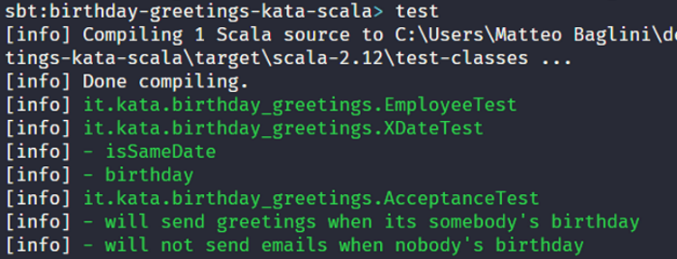

+++ 
## they @color[GoldenRod](test only)
## at @color[IndianRed](system level)

+++
## System Tests
```scala
def setup(): SimpleSmtpServer = {
  SimpleSmtpServer.start(NONSTANDARD_PORT)
}

def tearDown(mailServer: SimpleSmtpServer): Unit = {
  mailServer.stop()
}

test("will send greetings when its somebody's birthday") { mailServer =>
  sendGreetings("employee_data.txt", XDate("2008/10/08"),
                "localhost", NONSTANDARD_PORT)

  assert(mailServer.getReceivedEmailSize == 1, "message not sent?")
  val message = mailServer.getReceivedEmail()
                    .next().asInstanceOf[SmtpMessage]
  assertEquals("Happy Birthday, dear John!", message.getBody)
  assertEquals("Happy Birthday!", message.getHeaderValue("Subject"))
```

@[1-7](setup the SMTP server)
@[8-17](interact with file system and network)

---
# @color[GoldenRod](Pure)
# Functional
# @color[IndianRed](Programming)

+++
## Functional Programming
@color[GoldenRod](compose functions) as a central<br />
building block to write software
<br /><br />
```scala
val fun: A => B

val toS: Int => String = 
  n => n.toString

val fromS: String => Int = 
  s => s.length

val toAndFrom: Int => Int = 
  fromS compose toS
```
@[1](from _somthing_ to _something_)
@[3-4](from Int to String)
@[6-7](from String to Int)
@[9-10](function composition)

+++
## The pure version
in this context function refer to the @color[IndianRed](mathematical) one
- @color[GoldenRod](Totaly): A function must yield a value for every possible input
- @color[GoldenRod](Determinism): A function must yield the same value for the same input
- @color[GoldenRod](Pure): A function’s only effect must be the computation of its return value

+++
## This is not "allowed"
```scala
val toS : Int => String = n => {
  appendAll("log.txt", "some content")
  n.toString
}
```

+++
## Nor even this
```scala
val list = collection.mutable.ListBuffer[Int]()
val toS : Int => String = n => {
  list += n
  if (list.size < 42) n.toString
  else "Yo!"
}
```

+++
## Work w/out side-effects
## is a @color[IndianRed](huge) constraint
## why @color[GoldenRod](embrace) it?

+++
## Side-effects are a complexity source
- hide inputs and outputs
- destroy testability
- destroy composability

+++
## Pure Functional Programming
## is about @color[IndianRed](eliminating) 
## or @color[GoldenRod](controlling) side-effects

+++
## Functions become
## @color[GoldenRod](Referentially Transparent)

+++
## Referential Transparency
An @color[GoldenRod](expression can be replaced) with its corresponding value @color[IndianRed)(without changing) the program's behavior

+++
## Referential Transparency
it means that these programs produce the same result
```scala
val x = foo(42)
val y = x + x
```

```scala
val y = foo(42) + foo(42)
```

+++
## No Referential Transparency
```scala
val x = iterator.next()
val y = x + x
```

```scala
val y = iterator.next() + iterator.next()
```

+++
## Purity/Referential Transparency Benefits
functions get an @color[IndianRed](extraordinary quality) boost:
- easier to @color[GoldenRod](reason)
- easier to @color[GoldenRod](compose)
- easier to @color[GoldenRod](refactor)
- easier to @color[GoldenRod](test)

+++
> “Functional programming (pure or otherwise) @color[GoldenRod](isn't the goal) of software engineering.<br/ ><br />Rather, @color[IndianRed](it’s a means to an end), like every other tool in the bag of a software engineer.” <br />- John A De Goes 

---
# @color[GoldenRod](Onion)
# @color[IndianRed](Architecture)

+++
## What is it?
<br />
### it's an @color[GoldenRod](architectural stereotype)
### useful to decompose a system
### in a @color[IndianRed](modular and composable) way

+++
## Alias
<br />
### @color[IndianRed](hexagonal)
or
### @color[GoldenRod](port/adapter)

+++
## 10,000 Feet View
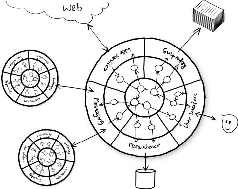

+++
## Onion rules
- The application is built around an @color[GoldenRod](independent domain)
- Direction of @color[GoldenRod](coupling is toward the center)
- Domain code can be @color[GoldenRod](run separate from infrastructure)

+++
## Zoom in @size[0.2em](1/2)
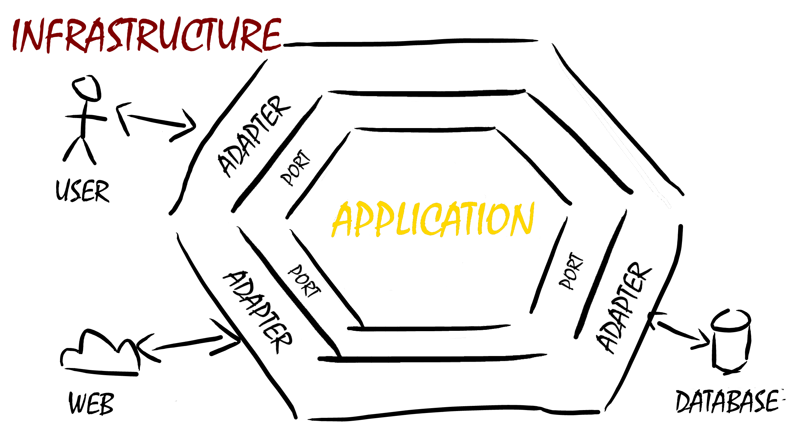

+++
## Zoom in @size[0.2em](2/2)
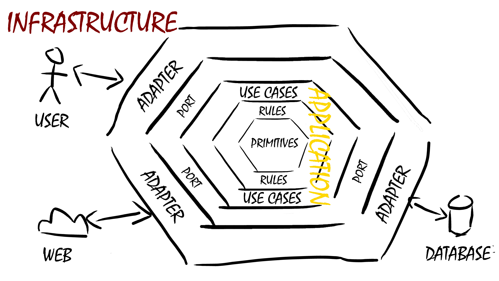

+++
## Architecture Benefits
- domain's code speaks loudly
- infrastructure's code is contained
- encapsulate different levels of abstraction
- centralize cross-cutting concerns
- reduce the need of system tests

+++
## Onion as a radar
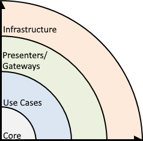

---
# Let the
# @color[IndianRed](marriage) begins

+++
## Remember?
```scala
def sendGreetings(fileName: String,
                  today: XDate,
                  smtpHost: String,
                  smtpPort: Int): Unit = {
  val in = new BufferedReader(new FileReader(fileName))
  var str = ""
  str = in.readLine // skip header
  while ({ str = in.readLine; str != null }) {
    val employeeData = str.split(", ")
    val employee = Employee(employeeData(1),
                            employeeData(0),
                            employeeData(2),
                            employeeData(3))

    if (employee.isBirthday(today)) {
      val recipient = employee.email
      val body = s"Happy Birthday, dear ${employee.firstName}!"
      val subject = "Happy Birthday!"

      sendMessage(smtpHost,
                  smtpPort,
                  "sender@here.com",
                  subject,
                  body,
                  recipient)
    }
  }
}
```

+++
## Now
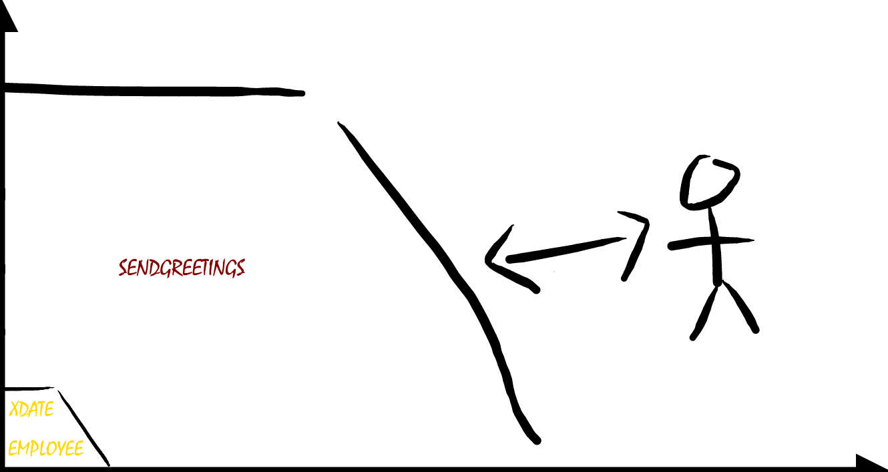

+++
## Final Vision


+++
## Onion + Pure FP shopping list
- split responsibilities in functions
    - push I/O at the boundary of the system
- remove mutable variables
- handle side-effect (I/O)
- express acceptance tests without infrastructure

--- 
# Split @color[GoldenRod](responsibilities)

+++
## high level view
```scala
def sendGreetings(fileName: String,
                  today: XDate,
                  smtpHost: String,
                  smtpPort: Int): Unit = {
  // open file ...                      
  while ({ str = in.readLine; str != null }) {
    // ... build employee
    // ... birthday check
    // ... send message
  }
}
```
@[6-10](refactoring blind spot)

+++
## split loops
```scala
def sendGreetings(fileName: String // ...
  val loadedBuffer = new ListBuffer[Employee]
  val in = new BufferedReader(new FileReader(fileName))
  var str = in.readLine // skip header
  while ({ str = in.readLine; str != null }) {
    val employeeData = str.split(", ")
    val employee = Employee(employeeData(1),
                            employeeData(0),
                            employeeData(2),
                            employeeData(3))
    loadedBuffer += employee
  }
  val loaded = loadedBuffer.toList

  val birthdaysBuffer = new ListBuffer[Employee]
  for (employee <- loaded) {
    if (employee.isBirthday(today)) {
      birthdaysBuffer += employee
    }
  }
  val birthdays = birthdaysBuffer.toList

  for (employee <- birthdays) {
    val recipient = employee.email
    val body = s"Happy Birthday, dear ${employee.firstName}!"
    val subject = "Happy Birthday!"

    sendMessage(smtpHost,
                smtpPort,
                "sender@here.com",
                subject,
                body,
                recipient)
  }
}  
```
@[2-13](one loop to parse the file)
@[15-21](one loop to filter employees)
@[23-34](one loop to send messages)

+++
## Extract functions
```scala
def sendGreetings(fileName: String // ...
  val loaded = loadEmployees(fileName)
  val birthdays = haveBirthday(loaded, today)
  sendMessages(smtpHost, smtpPort, birthdays)
}
```

+++
## Current status
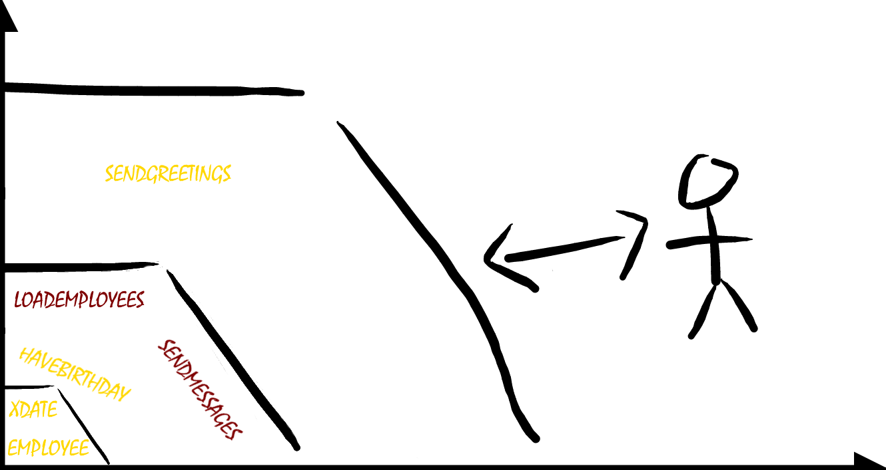

--- 
# Remove
# @color[IndianRed](mutable)
# state

+++
## Imperative style
```scala
private def loadEmployees(fileName: String): List[Employee] = {
  val buffer = new ListBuffer[Employee]
  val in = new BufferedReader(new FileReader(fileName))
  var str = in.readLine // skip header
  while ({ str = in.readLine; str != null }) {
    val employeeData = str.split(", ")
    val employee = Employee(employeeData(1),
                            employeeData(0),
                            employeeData(2),
                            employeeData(3))
    buffer += employee
  }
  buffer.toList
}
```
@[4-5](mutable var for each line)
@[2,11](mutable collection as accumulator)

+++
## Declarative style
```scala
private def loadEmployees(fileName: String): List[Employee] = {
  val source = io.Source.fromFile(fileName)
  val lines = source.getLines.toList
  lines
    .drop(1) // skip header
    .map(line => {
        val employeeData = str.split(", ")
        val employee = Employee(employeeData(1),
                                employeeData(0),
                                employeeData(2),
                                employeeData(3))
        employee
    })
}
```
@[3](load all lines)
@[4-6](parse lines)
@[2-3,7-12](different level of abstractions)

+++
## Same level of abstraction
```scala
private def loadEmployees(fileName: String): List[Employee] = {
  loadLines(fileName)
    .drop(1) // skip header
    .map(line => parse(line))
}
```
@[2](load all lines)
@[3](skip the first)
@[4](and then parse each one)

+++
## Abstraction escalation
```scala
private def loadLines(fileName: String)
                    : List[String]

private def loadEmployees(fileName: String)
                    : List[Employee]
```
@[2](from List[String])
@[5](to List[Employee])

+++
## Imperative style
```scala
private def haveBirthday(employees: List[Employee],
                         today: XDate): List[Employee] = {
  val employees = new ListBuffer[Employee]
  for (employee <- employees) {
    if (employee.isBirthday(today)) {
      employees += employee
    }
  }
  employees.toList
}
```
@[4-5](filter logic)

+++
## Declarative style
```scala
private def haveBirthday(employees: List[Employee],
                         today: XDate): List[Employee] =
  employees
    .filter(employee => employee.isBirthday(today))
```

+++
## No mutable state but...
```scala
private def sendMessages(smtpHost: String,
                         smtpPort: Int,
                         employees: List[Employee]): Unit = {
  for (employee <- employees) {
    val recipient = employee.email
    val body = s"Happy Birthday, dear ${employee.firstName}!"
    val subject = "Happy Birthday!"

    sendMessage(smtpHost,
                smtpPort,
                "sender@here.com",
                subject,
                body,
                recipient)
  }
}
```

+++
## Inline sendMessage
```scala
private def sendMessages(smtpHost: String,
                         smtpPort: Int,
                         employees: List[Employee]): Unit = {
  for (employee <- employees) {
    val recipient = employee.email
    val sender = "sender@here.com"
    val body = s"Happy Birthday, dear ${employee.firstName}!"
    val subject = "Happy Birthday!"

    val props = new Properties
    props.put("mail.smtp.host", smtpHost)
    props.put("mail.smtp.port", "" + smtpPort)
    val session = Session.getInstance(props, null)

    val msg = new MimeMessage(session)
    msg.setFrom(new InternetAddress(sender))
    msg.setRecipient(Message.RecipientType.TO, 
                     new InternetAddress(recipient))
    msg.setSubject(subject)
    msg.setText(body);

    Transport.send(msg)
  }
}
```
@[10-13](smtp connection)
@[5-8,15-20](compose message)
@[22](final send)

+++
## Extract functions
```scala
private def sendMessages(smtpHost: String,
                         smtpPort: Int,
                         employees: List[Employee]): Unit = {
  for (employee <- employees) {
    val session = buildSession(smtpHost, smtpPort)
    val msg = buildMessage(session, employee)
    Transport.send(msg)
  }
}
```

+++
## Extract new sendMessage
```scala
private def sendMessages(smtpHost: String,
                         smtpPort: Int,
                         employees: List[Employee]): Unit = {
  for (employee <- employees)
    sendMessage(smtpHost, smtpPort, employee)
}
```

---
# Handle @color[IndianRed](side-effects)

+++
## IO Monad
@color[GoldenRod](capture) the intent of I/O on invocation and<br />
@color[GoldenRod](delays) their execution until @color[IndianRed](explicitly requested)

+++ 
## Embedded DSL
- @color[GoldenRod](Language): a data structure that caputure I/O
- @color[IndianRed](Interpreter): an *engine* that actually execute I/O

+++
## Benefits
@color[IndianRed](evidence code) that interact<br />
with the outside world and even more important<br />
@color[GoldenRod](preserves referential transparency)

+++
## Which one have side-effects?
```scala
def loadEmployees(/*...*/)
        : List[Employee]

def haveBirthday(/*...*/)
        : List[Employee]

def sendMessages(/*...*/)
        : Unit
```

+++
## Again, which one have side-effects?
```scala
def loadEmployees(/*...*/)
        : IO[List[Employee]]

def haveBirthday(/*...*/)
        : List[Employee]

def sendMessages(/*...*/)
        : IO[Unit]
```
@[2,5,8](explicit return type)

+++
## First example
## @color[IndianRed](NO) REFERENTIAL TRANSPARENCY
## @color[GoldenRod](Future)

+++
## Ask two numbers
```scala
def askInt(): Future[Int] = 
  Future(println("Please, give me a number:"))
    .flatMap(_ => Future(io.StdIn.readLine().toInt))

def askTwoInt(): Future[(Int, Int)] =
  for {
    x <- askInt()
    y <- askInt()
  } yield (x , y)

def program(): Future[Unit] =
  askTwoInt()
    .flatMap(pair => Future(println(s"Result: ${pair}")))
```
@[1](ask a number)
@[5](ask two numbers)
@[11-13](the program)

+++
## It works!
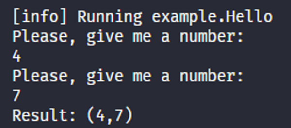

+++
## Look closely
```scala
def askTwoInt(): Future[(Int, Int)] =
  for {
    x <- askInt()
    y <- askInt()
  } yield (x , y)
```
@[3-4](two sequential calls)

+++
## First Refactoring
```scala
def askTwoInt(): Future[(Int, Int)] = {
  val sameAsk = askInt()
  for {
    x <- sameAsk
    y <- sameAsk
  } yield (x , y)
}
```
@[2,4-5](extract local and call it twice)

+++
## Oh no! Bug!
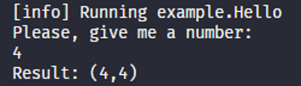

+++
## Second Refactoring
```scala
def askTwoInt(): Future[(Int, Int)] = {
  val ask1 = askInt()
  val ask2 = askInt()
  for {
    x <- ask1
    y <- ask2
  } yield (x , y)
}
```
@[2-3,5-6](extract two locals and call them both)

+++
## WTF? Another bug!
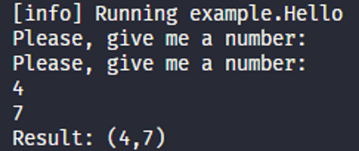

+++
## Second example
## @color[IndianRed](YES) REFERENTIAL TRANSPARENCY
## @color[GoldenRod](IO MONAD)

+++
## Same program
```scala
def askInt(): IO[Int] = 
  IO(println("Please, give me a number:"))
    .flatMap(_ => IO(io.StdIn.readLine().toInt))

def askTwoInt(): IO[(Int, Int)] =
  for {
    x <- askInt()
    y <- askInt()
  } yield (x , y)

def program(): IO[Unit] =
  askTwoInt()
    .flatMap(pair => IO(println(s"Result: ${pair}")))
```

+++
## Same Refactoring
```scala
def askTwoInt(): IO[(Int, Int)] = {
  val sameAsk = askInt()
  for {
    x <- sameAsk
    y <- sameAsk
  } yield (x , y)
}
```

```scala
def askTwoInt(): IO[(Int, Int)] = {
  val ask1 = askInt()
  val ask2 = askInt()
  for {
    x <- ask1
    y <- ask2
  } yield (x , y)
}
```

+++
## It works!


+++
## IO Monad in Scala
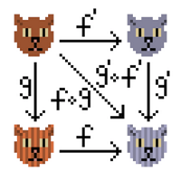


+++
## Let's start from input operation
```scala
private def loadLines(fileName: String): List[String] = {
  val source = io.Source.fromFile(fileName)
  try source.getLines.toList
  finally source.close
}
```
@[1](return List[String])
+++
## Done!
```scala
private def loadLines(fileName: String): IO[List[String]] = IO {
  val source = io.Source.fromFile(fileName)
  try source.getLines.toList
  finally source.close
}
```
@[1](return IO[List[String]])

+++
## Safe resource acquisition/release
```scala
private def loadLines(fileName: String): IO[List[String]] =
  IO(io.Source.fromFile(fileName))
    .bracket { source => IO(source.getLines.toList) } 
             { source => IO(source.close) }
```

+++
## Compose with upper layer
```scala
private def loadEmployees(fileName: String): IO[List[Employee]] = {
  loadLines(fileName).map { lines =>
    lines
      .drop(1) // skip header
      .map(line => parse(line))
  }
}
```
@[3-5](unchanged parsing logic)
@[2, 6](wrap in a map)
@[1](propagate IO)

+++
## Continue with output operation
```scala
private def sendMessage(smtpHost: String,
                        smtpPort: Int,
                        employee: Employee): Unit = {
  val session = buildSession(smtpHost, smtpPort)
  val msg = buildMessage(session, employee)
  Transport.send(msg)
}
```
@[3](return Unit)

+++
## Wrap function expression
```scala
private def sendMessage(smtpHost: String,
                        smtpPort: Int,
                        employee: Employee): IO[Unit] = IO {
  val session = buildSession(smtpHost, smtpPort)
  val msg = buildMessage(session, employee)
  Transport.send(msg)
}
```
@[3](return IO[Unit])

+++
## Execution of many I/O
```scala
private def sendMessages(smtpHost: String,
                         smtpPort: Int,
                         employees: List[Employee]): Unit = {
  for (employee <- employees)
    sendMessage(smtpHost, smtpPort, employee)
}
```
@[3](return Unit)

+++
## Construction of many IO
```scala
private def sendMessages(smtpHost: String,
                         smtpPort: Int,
                         employees: List[Employee]): List[IO[Unit]] = {
  employees.map { employee =>
    sendMessage(smtpHost, smtpPort, employee)
  }
}
```
@[4](from Employee to IO[Unit])
@[3](List[IO[Unit]] it's not what we want)

+++
## Map vs Traverse
- @color[GoldenRod](map): produces a @color[GoldenRod](List[IO[Unit]])
- @color[IndianRed](traverse): produces a @color[IndianRed](IO[List[Unit]])

+++
## Traverse power!
```scala
private def sendMessages(smtpHost: String,
                         smtpPort: Int,
                         employees: List[Employee]): IO[List[Unit]] = {
  employees.traverse { employee =>
    sendMessage(smtpHost, smtpPort, employee)
  }
}
```
@[4](traversal over a structure with an effect)
@[3](better but List of Unit is like Unit)

+++
## Discard results
```scala
private def sendMessages(smtpHost: String,
                         smtpPort: Int,
                         employees: List[Employee]): IO[Unit] = {
  employees.traverse_ { employee =>
    sendMessage(smtpHost, smtpPort, employee)
  }
}
```
@[4](discard results)
@[3](perfect!)

+++
## Use case
```scala
def sendGreetings(fileName: String,
                  today: XDate,
                  smtpHost: String,
                  smtpPort: Int): Unit = {
  val loaded = loadEmployees(fileName)
  val birthdays = haveBirthday(loaded, today)
  sendMessages(smtpHost, smtpPort, birthdays)
}
```
@[4](return Unit)

+++
## Push up I/O execution
```scala
def sendGreetings(fileName: String,
                  today: XDate,
                  smtpHost: String,
                  smtpPort: Int): IO[Unit] = {
  loadEmployees(fileName)
    .map(loaded => haveBirthday(loaded, today))
    .flatMap(birthdays => sendMessages(smtpHost, smtpPort, birthdays))
}
```
@[4](return IO[Unit])
@[5]("register" a loadEmployees operations)
@[6](then change the content with map)
@[7](then replace the content with flatMap)

+++
## The original Main
```scala
def main(args: Array[String]): Unit = {
  sendGreetings("employee_data.txt", XDate(), "localhost", 25)
}
```

+++
## The IO Monad Main
```scala
def main(args: Array[String]): Unit = {
  sendGreetings("employee_data.txt", XDate(), "localhost", 25)
    .unsafeRunSync()
}
```
@[3](execute I/O at "the end of the world")

---
# Split @color[GoldenRod](domain)
# From @color[IndianRed](infrastructure)

+++
## Now


+++
## Final Vision


+++
## The Onion architecture pillar
<br />
### @color[GoldenRod](Dependency Inversion Principle)

+++
## Dependency Inversion Principle
- @color[GoldenRod](High-level modules) should not depend on low-level modules. Both should depend on abstractions.
- @color[IndianRed](Abstractions) should not depend on details. Details should depend on abstractions.

+++
## DIP into Onion
- Inner layers define interfaces (@color[GoldenRod](Ports))
- Outer layers implement interfaces (@color[IndianRed](Adapters))

+++
## Infrastructure entry points
```scala
  def loadEmployees(fileName: String): IO[List[Employee]]

  def sendMessages(smtpHost: String, 
                   smtpPort: Int, 
                   employees: List[Employee]): IO[Unit]

  def sendGreetings(fileName: String,
                    today: XDate, 
                    smtpHost: String, 
                    smtpPort: Int): IO[Unit]
```

+++
## Split parameters
```scala
def loadEmployees()
                 (fileName: String): IO[List[Employee]]

def sendMessages(employees: List[Employee])
                (smtpHost: String, 
                 smtpPort: Int): IO[Unit]                       

def sendGreetings(today: XDate)
                 (fileName: String, 
                  smtpHost: String, 
                  smtpPort: Int): IO[Unit]
```
@[1,4,8](domain)
@[2,5-6,9-11](infrastructure)

+++
## Define the first Port
```scala
trait EmployeeRepository {
  def loadEmployees(): IO[List[Employee]]
}
```

+++
## Implement the first Adapter
```scala
object FlatFileEmployeeRepository {

  def fromFile(fileName: String): EmployeeRepository = 
    new EmployeeRepository {

    def loadEmployees(): IO[List[Employee]] = {
      loadLines().map { lines =>
        lines
          .drop(1) // skip header
          .map(parseEmployee(_))
      }
    }

    // ... loadLines and parseEmployee ...
  }
}
```
@[1](the adapter module specify the technology)
@[3-4](the real adapter is provided as anonymous class)
@[6-12](do the file related stuff)

+++
## Define the second Port
```scala
trait MessageGateway {
  def sendMessages(employees: List[Employee]): IO[Unit]
}
```

+++
## Define the second Port
```scala
trait MessageGateway {

  def sendMessages(employees: List[Employee]): IO[Unit] =
    employees.traverse_(employee => sendMessage(employee))

  def sendMessage(employee: Employee): IO[Unit]
}
```
@[3-4](thanks to traverse we can put the implementation here)
@[6](and open sendMessage)

+++
## Implement the second Adapter
```scala
object SmtpMessageGateway {

  def fromEndpoint(smtpHost: String, smtpPort: Int): MessageGateway =
    new MessageGateway {

      def sendMessage(employee: Employee): IO[Unit] = IO {
        val session = buildSession()
        val msg = buildMessage(session, employee)
        Transport.send(msg)
      }

      // ...buildSession and buildMessage
    }
}
```
@[1](the adapter module specify the technology)
@[3-4](the real adapter is provided as anonymous class)
@[6-12](do the smtp related stuff)

+++
## Request Ports
```scala
def sendGreetings(today: XDate)
                 (employeeRepository: EmployeeRepository,
                  messageGateway: MessageGateway): IO[Unit]
```
@[2-3](no more file and smtp parameters)

+++
## Provide Adapters
```scala
def main(args: Array[String]): Unit = {
  val employeeRepository = 
        FlatFileEmployeeRepository.fromFile("employee_data.txt")
  val messageGateway = 
        SmtpMessageGateway.fromEndpoint("localhost", 25)

  sendGreetings(XDate())
    (employeeRepository, messageGateway)
    .unsafeRunSync()
}
```
@[2-5](build the concrete adapters)
@[8](inject into sendGreetings)

+++
## Scala implicit to the rescue
```scala
def sendGreetings(today: XDate)
                 (implicit employeeRepository: EmployeeRepository, 
                           messageGateway: MessageGateway): IO[Unit]
```
@[2-3](mark the parameters as implicit)

+++
## Scala implicit to the rescue
```scala
def main(args: Array[String]): Unit = {
  implicit val employeeRepository = 
        FlatFileEmployeeRepository.fromFile("employee_data.txt")
  implicit val messageGateway = 
        SmtpMessageGateway.fromEndpoint("localhost", 25)

  sendGreetings(XDate())
    .unsafeRunSync()
}
```
@[2-5](mark provided values as implicit)
@[7-8](remove explicit injection)

+++
## Final implementation
```scala
def sendGreetings(today: XDate)
                 (implicit employeeRepository: EmployeeRepository, 
                           messageGateway: MessageGateway): IO[Unit] =
  employeeRepository
    .loadEmployees()
    .map(loaded => haveBirthday(loaded, today))
    .flatMap(birthdays => messageGateway.sendMessages(birthdays))
```

---
# @color[GoldenRod](Acceptance tests) w/out @color[IndianRed](infrastructure)

+++
## Test adapters
```scala
class FakeEmployeeRepository(employees: List[Employee]) 
    extends EmployeeRepository {

  def loadEmployees(): IO[List[Employee]] = IO {
    employees
  }
}

class FakeMessageGateway 
    extends MessageGateway {

  val receivers = new collection.mutable.ListBuffer[Employee]

  def sendMessage(e: Employee): IO[Unit] = IO {
    receivers += e
  }
}
```
@[1-7](fake repository)
@[4-6](lift value into IO)
@[9-17](fake gateway)

+++
## In memory acceptance tests
```scala
 test("will send greetings when its somebody's birthday") {
   val john = Employee("John", "Doe", 
                       "1982/10/08", "john.doe@foobar.com")
   val mary = Employee("Mary", "Ann", 
                       "1975/03/11", "mary.ann@foobar.com")
   implicit val fakeEmployeeRepository = 
                    new FakeEmployeeRepository(List(john, mary))
   implicit val fakeMessageGateway =        
                    new FakeMessageGateway()

   sendGreetings(XDate("2008/10/08"))
     .unsafeRunSync()

   assert(fakeMessageGateway.receivers.size == 1)
   assert(fakeMessageGateway.receivers.contains(john))
 }
```
@[2-7](setup fake repository)
@[8-9](setup fake gateway)
@[11-12](execute usecase)
@[14-15](simple asserts)

---
# Closing notes

+++
## Next steps
- abstract over effect type
- make invalid state unrepresentable
- remove mutable state from acceptance tests
- use streaming I/O (from IO[List[A]] to Stream[IO, A])

+++
## Play with requirements
- handle error and print graceful messages
- remove dependency from configuration parameters
- different content for male/female (Mr/Ms)
- different infrastructure employee (SMTP + SMS) 

+++
## Conclusion

- Onion rules plus radar technique to @color[GoldenRod](distribute and encapsulate responsibilities)
- Functional Programming technique to @color[IndianRed](compose behaviours and layers)

+++
# @color[GoldenRod](Thanks)